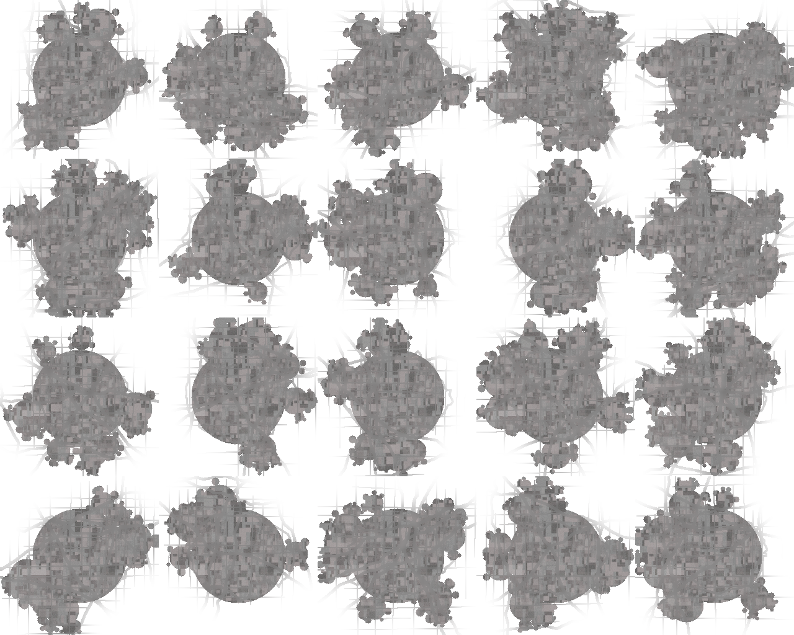
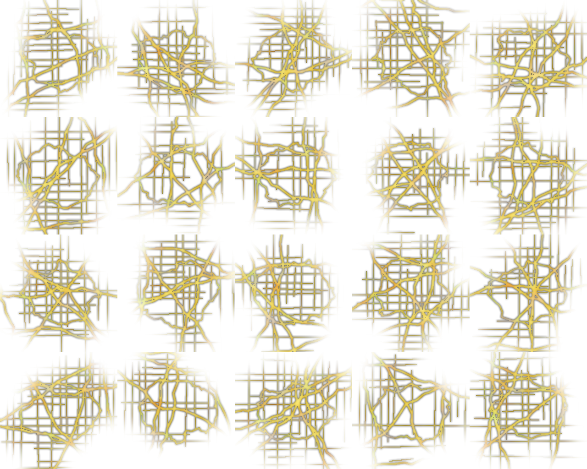

## Cities From Space

cities-from-space is a procedural texture generation program written in C
designed to create city decals for space games. These decals can be pasted onto
spherical planet models to represent sprawling urban areas.

The program generates two texture maps for each city, a diffuse map for the
daylight side and an emittance map for the night side.

Multiple city decals may be generated at once and packed into a (mostly)
square grid atlas.

The program expects the following PNG files to be present in the execution directory:

* city-texture.png — Base texture for urban areas.
* road-texture.png — Texture used for day-side road networks.
* lights-texture.png — Texture mapped to city lights on the emittance map.

# License

The authorship of the program was heavily aided by Gemini Pro and consequently
it is essentially uncopyrightable. For that reason it falls into the public
domain.

# Sample Output

Diffuse map atlas:

Emittance map atlas:

